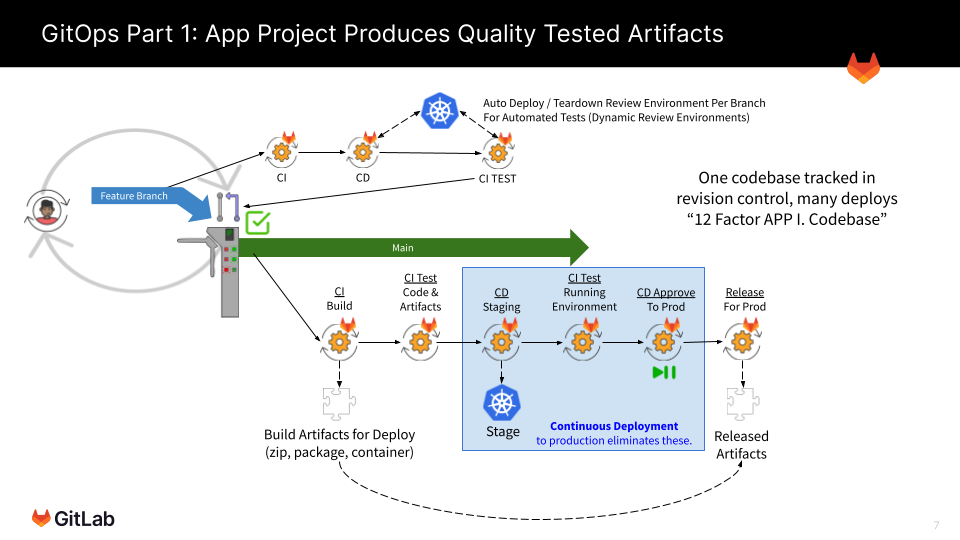

# Lab 4.2: Prepare the Application Project

> **Keyboard Time**: 20 mins, **Automation Wait Time**: 2 mins
>
> **Scenarios:** Instructor-Led, Self-Paced

{}{}

{}

Before continuning make sure to use DNSChecker.com to check if both `the Load Balancer DNS Name` and `Load Balancer IP`**.nip.io** have propagated through global DNS and wait (or troubleshoot) if they have not.
{}

{}

This project auto-increments images with a simple semantic version (prereleases not supported). You can also force a specific version number and tell it which part of the version number to auto-increment.
{}

1. While in 'yourpersonalgroup' (created in a prior lab) *Click* **New project** (button) and then *Click* **Import project**

2. On the 'Import project' page, *Click* **Repo by URL**

3. On the next page, for 'Git repository URL' *Paste* **https://gitlab.com/guided-explorations/gl-k8s-agent/gitops/apps/hello-world.git**

4. In 'Project name' *Type* **Hello World** (may already be defaulted to this)

5. Near the bottom of the page *Click* **Create project** (button)

6. When the import is complete, you will be placed in the default landing page of the project.

7. While in the project 'yourpersonalgroup/hello-world', *Click* **Settings => General**

8. Next to ‘Visibility, project features, permissions’, *Click* **Expand**

9. Under Project visibility, *Select* **Public**

10. *Deselect* **Users can request access**

11. Scroll down to locate and *Click* **Save changes**

12. On the left navigation bar, *Click* **CI/CD => Pipelines**

13. In the upper right of the page, *Click* **Run pipeline** (button)

14. On the ‘Run pipeline page’, leave the defaults and in the lower left of the page *Click* **Run pipeline** (button)

     > The code is designed to increment an image version from the container registry of your project. If no image is found, it starts at version 0.0.1.

15. **[Automation wait: ~1 min]** Wait for the pipeline to complete successfully.

16. On the left navigation panel, *Click* **Packages & Registries => Container Registry**

17. On the Container Registry page click the item ending in “/main”

     > You should see a version tag, a git short sha tag and a latest tag that all have the same value for “Digest”

18. On the left navigation bar, *Click* **CI/CD => Pipelines**

19. In the upper right of the page, *Click* **Run pipeline** (button)

20. On the ‘Run pipeline page’, Change the variable “NEXTVERSION” to **1.0.0** (overwrite ‘increment-existing-image-version’)

21. *Click* **Run pipeline** (button)

22. **[Automation wait: ~1 min]** Wait for the pipeline to complete successfully.

23. On the left navigation bar, *Click* **Packages & Registries => Container Registry**

24. On the Container Registry page **click the [line item ending in “/main”]**

     > Among the tags you should see a 0.0.1 version tag and a 1.0.0 version tag.
     >
     > Note: the next time the pipeline runs it will increment 1.0.0 to 1.0.1 automatically because it will read the current version from the latest image.

### Create a Token To Read The Container Registry

> For the next steps you will create a Deployment Token so that the CI job can commit the kubernetes manifests back to its own repository. For production, if you have licensed GitLab a group level ‘Access Token’ is a better way to ensure that the automation credentials do not depend on regular user credentials.

1. While in 'yourpersonalgroup' (be sure you are in the group, not a project) in the left navigation, *Click* **Settings => Repository** (button) 

2. Next to ‘Deploy tokens’ *Click* **Expand**

3. Under ‘New deploy token’, for Name, *Type* **ReadContainerRegistry**

4. Under ‘Scopes (select at least one)’, *Select* **read_registry**

5. *Click* **Create deploy token** 

6. Under ‘Your new Deploy Token username’, to the right of the **FIRST** value, *Click* **[the Clipboard Icon]**

7. **In a NEW browser tab**, open 'yourpersonalgroup' (the group level - not the hello-world project)

8. On the left navigation, *Click* **Settings => CI/CD**

9. To the right of ‘Variables’, *Click* **Expand**

10. *Click* **Add variable**

11. For Key, *Type* **READ_REG_USER**

12. In the Value field *Paste* **[the Clipboard contents]**

13. Under Flags, *Deselect* **Protect variable**

14. In your browser tabs, *Switch* to the **[Deploy Token browser tab]**

15. Under ‘Your new Deploy Token username’, to the right of the **SECOND** value, *Click* **[the Clipboard Icon]**

16. *Switch* to the **[CD/CD Variables browser tab]**.

17. *Click* **Add variable**

18. For Key, *Type* **READ_REG_TOKEN**

19. In the Value field *Paste* **[the Clipboard contents]**

20. Under Flags, *Deselect* **Protect variable**

21. Under Flags, *Select* **Mask variable**

22. *Click* **Add variable**

    > You should now have two variables in 'yourpersonalgroup' that contains READ_REG_USER and READ_REG_TOKEN with the values from the Deploy Token creation.

{}

This least privilege approach publishes registry read credentials to the entire subgroup heirarchy for all registries in the same heirarchy. This is a handy method when there are many Application Projects whose images are being used by many Environment Deployment Projects that share a common parent group.
{}
